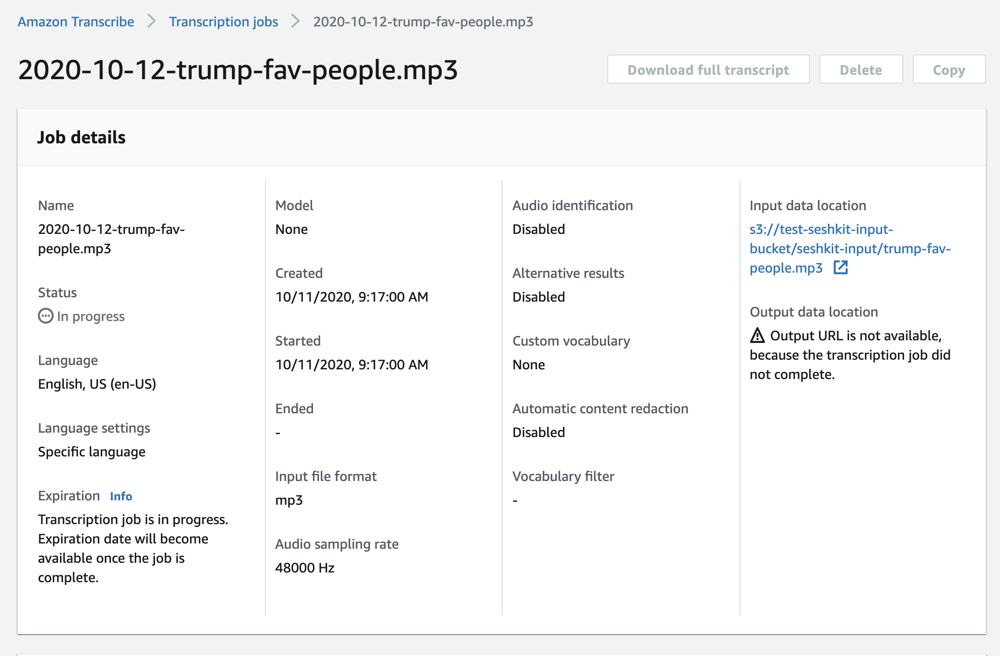
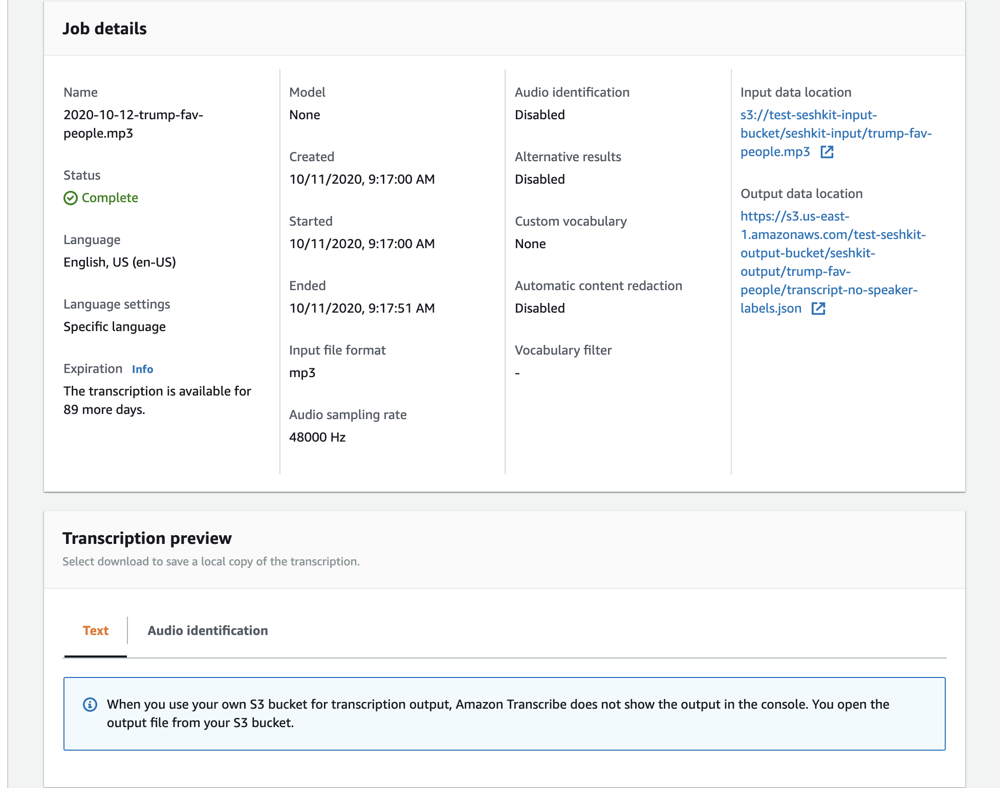
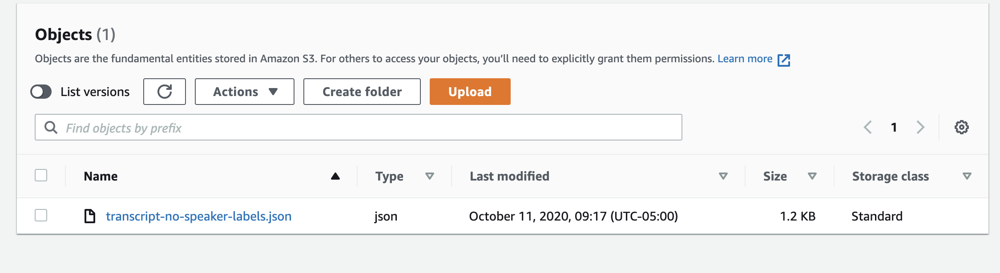

**************************************
Example of AWS transcribe using awscli
**************************************

.. contents:: :local:

Using awscli
============

transcribe: Request to start job
--------------------------------

.. code-block:: sh

    aws transcribe start-transcription-job \
        --profile seshkit \
        --language-code 'en-US' \
        --media-format 'mp3' \
        --transcription-job-name '2020-10-12-trump-fav-people.mp3' \
        --media '{"MediaFileUri": "s3://test-seshkit-input-bucket/seshkit-input/trump-fav-people.mp3"}' \
        --output-key 'seshkit-output/trump-fav-people/transcript-no-speaker-labels.json' \
        --output-bucket-name 'test-seshkit-output-bucket'

transcribe: Getting job status
------------------------------

.. code-block:: sh

    aws transcribe get-transcription-job \
        --profile seshkit \
        --transcription-job-name '2020-10-12-trump-fav-people.mp3'

s3: Request for output
----------------------

.. code-block:: sh

    aws s3 cp \
        --profile seshkit \
        s3://test-seshkit-output-bucket/seshkit-output/trump-fav-people/transcript-no-speaker-labels.json \
        /tmp/simple-transcript.json

Web interface
=============

Transcribe panel
----------------

https://console.aws.amazon.com/transcribe/home#job-details/2020-10-12-trump-fav-people.mp3

In progress:

Completed:

S3 Output bucket panel:

https://s3.console.aws.amazon.com/s3/buckets/test-seshkit-output-bucket?prefix=seshkit-output/

Data responses
==============

Job in progress
---------------

.. literalinclude:: /../examples/aws/transcribe/simple/simple-response-in-progress.json

Job is completed
----------------

.. literalinclude:: /../examples/aws/transcribe/simple/simple-response-completed.json

Transcript
----------

.. literalinclude:: /../examples/aws/transcribe/simple/simple-transcript.json

References
==========

CLI API: https://docs.aws.amazon.com/cli/latest/reference/transcribe/start-transcription-job.html

Another example: https://gist.github.com/dannguyen/9b8c51f5bb853209f19f1a0f18f0f74c
